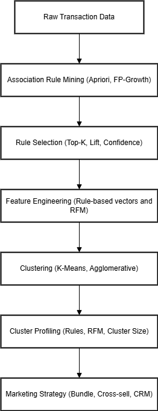
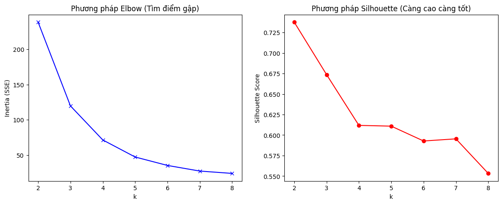
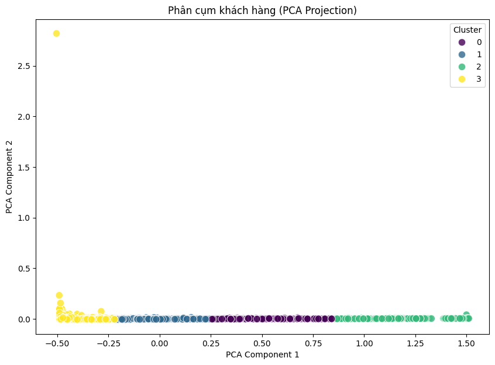

# Phân cụm khách hàng dựa trên luật kết hợp

> **Mini Project – Data Mining**  
> Chủ đề: Association Rules × Clustering × Marketing Strategy

---

## 📌 Mục lục
1. Bài toán đặt ra  
2. Ý tưởng cốt lõi của dự án  
3. Vì sao chọn Unsupervised Learning và K-Means?  
4. Trích xuất đặc trưng từ luật kết hợp  
5. Quy trình phân cụm và lựa chọn số cụm K  
6. Trực quan hóa và đánh giá cụm  
7. Profiling và diễn giải cụm  
8. Mở rộng và nâng cấp dự án  
9. Kết luận

---

## 1. Bài toán đặt ra

Trong phân tích hành vi khách hàng bán lẻ, một câu hỏi quen thuộc luôn được đặt ra: **làm thế nào để hiểu khách hàng không chỉ dựa trên họ mua bao nhiêu, mà còn dựa trên họ mua *cái gì cùng với cái gì*?**

Các mô hình truyền thống thường sử dụng RFM (Recency – Frequency – Monetary) để phân khúc khách hàng. Tuy nhiên, RFM chủ yếu phản ánh *giá trị* và *tần suất* mua sắm, chưa khai thác sâu cấu trúc giỏ hàng. Mini Project *Phân cụm khách hàng dựa trên luật kết hợp* được xây dựng nhằm giải quyết khoảng trống đó.

Thay vì phân cụm trực tiếp từ dữ liệu thô hay RFM, dự án đề xuất một hướng tiếp cận khác: **kết hợp khai phá luật kết hợp (Association Rules) với phân cụm (Clustering)** để tạo ra các phân khúc khách hàng dựa trên *mẫu hành vi mua kèm*.

---

## 2. Ý tưởng cốt lõi của dự án

Pipeline của dự án được thiết kế theo chuỗi logic:

**Luật kết hợp → Đặc trưng hành vi → Phân cụm → Diễn giải → Chiến lược marketing**

Cụ thể:

1. Sử dụng Apriori hoặc FP-Growth để khai phá các tập mục phổ biến và luật kết hợp từ dữ liệu giao dịch.
2. Chọn ra các luật “mạnh” (support đủ lớn, lift cao, confidence tốt).
3. Biến các luật này thành **vector đặc trưng** cho từng khách hàng/giỏ hàng.
4. Áp dụng các thuật toán phân cụm (đặc biệt là K-Means) để nhóm các hành vi tương đồng.
5. Phân tích và đặt tên các cụm, từ đó đề xuất hành động kinh doanh cụ thể.

Cách tiếp cận này giúp phân cụm không chỉ dựa trên *số liệu tổng hợp*, mà còn dựa trên *logic mua sắm thực tế* của khách hàng.

---

## 3. Vì sao chọn Unsupervised Learning và K-Means?

Dữ liệu giao dịch không có nhãn sẵn (không biết trước khách hàng “tốt/xấu”), do đó bài toán phù hợp với **Unsupervised Learning**.

Trong số các thuật toán phân cụm, K-Means được lựa chọn vì:

- Hoạt động hiệu quả với dữ liệu đa chiều.
- Dễ triển khai, dễ mở rộng cho dữ liệu lớn.
- Tâm cụm (centroid) giúp diễn giải hành vi của từng nhóm.
- Dễ kết hợp với các phương pháp chọn số cụm như Elbow hoặc Silhouette.

Tuy nhiên, dự án cũng nhấn mạnh hạn chế của K-Means: giả định cụm có dạng gần hình cầu theo khoảng cách Euclidean, vì vậy cần chuẩn hóa dữ liệu và đánh giá lại kết quả bằng trực quan hóa và profiling.

---

## 4. Trích xuất đặc trưng từ luật kết hợp

Điểm khác biệt quan trọng nhất của Mini Project nằm ở bước **feature engineering**.

### 4.1. Từ luật kết hợp đến vector đặc trưng

Mỗi luật kết hợp (ví dụ: `{Milk, Bread} → {Butter}`) được xem như một chiều đặc trưng.

- Nếu giỏ hàng/khách hàng thỏa mãn tiền đề (antecedent) của luật → giá trị = 1
- Nếu không thỏa → giá trị = 0

Kết quả là một ma trận **Customer × Rule** (hoặc Basket × Rule), phản ánh hành vi mua kèm của từng khách hàng.

### 4.2. Các biến thể đặc trưng

Dự án không dừng lại ở đặc trưng nhị phân, mà yêu cầu so sánh nhiều cấu hình:

- **Rule-only (baseline)**: đặc trưng nhị phân theo luật.
- **Rule có trọng số**: dùng lift, confidence hoặc lift × confidence để phản ánh độ mạnh của luật.
- **Rule + RFM**: kết hợp hành vi mua kèm với giá trị khách hàng.

Việc so sánh này giúp đánh giá xem thông tin nào thực sự cải thiện chất lượng phân cụm.

---

## 5. Quy trình phân cụm và lựa chọn số cụm K

Sau khi xây dựng vector đặc trưng, dự án tiến hành:

1. Chuẩn hóa dữ liệu (scaling).
2. Khảo sát số cụm K trong một khoảng hợp lý (ví dụ 2–10 hoặc 2–12).
3. Sử dụng **Silhouette Score** hoặc **Elbow Method** để chọn K.
4. Huấn luyện K-Means và gán nhãn cụm cho từng khách hàng.

Điểm quan trọng được nhấn mạnh: **K không chỉ “đẹp” về mặt chỉ số, mà còn phải có ý nghĩa hành động (actionable)** trong bối cảnh marketing.

---

## 6. Trực quan hóa và đánh giá cụm

Để đánh giá chất lượng phân cụm, dự án sử dụng trực quan hóa nhằm kiểm tra mức độ tách biệt giữa các nhóm.

### 📷 Hình 1: Pipeline tổng thể của dự án

```text
Luật kết hợp → Feature Engineering → Clustering → Profiling → Marketing Strategy
```


*Hình 1. Pipeline phân cụm khách hàng dựa trên luật kết hợp*

---

### 📷 Hình 2: Biểu đồ chọn số cụm K (Silhouette / Elbow)


*Hình 2. Silhouette Score dùng để lựa chọn số cụm K tối ưu*

Nhóm quan sát giá trị Silhouette đạt mức cao nhất (hoặc ổn định nhất) tại K phù hợp, đồng thời cân nhắc ý nghĩa marketing của từng cụm.

---

### 📷 Hình 3: Trực quan hóa cụm sau khi giảm chiều (PCA/SVD)


*Hình 3. Phân bố khách hàng trên không gian 2D sau PCA, tô màu theo cluster*

Từ biểu đồ có thể nhận xét mức độ tách cụm (rõ ràng hay chồng lấn), qua đó đánh giá tính hợp lý của cấu hình đặc trưng và số cụm đã chọn.

---

## 7. Profiling và diễn giải cụm – phần quan trọng nhất

Phân cụm chỉ thực sự có giá trị khi **diễn giải được**.

Mỗi cụm cần được phân tích theo:

- Số lượng khách hàng.
- Trung bình/Trung vị RFM (nếu có).
- Các luật kết hợp được kích hoạt nhiều nhất trong cụm.

Từ đó, nhóm cần:

- Đặt tên cho cụm (tiếng Anh + tiếng Việt).
- Mô tả persona của cụm trong 1 câu.
- Đề xuất **chiến lược marketing cụ thể**, ví dụ:
  - Bundle / cross-sell theo nhóm sản phẩm hay mua kèm.
  - Ưu đãi riêng cho nhóm khách hàng giá trị cao.
  - Chiến dịch kích hoạt lại khách hàng ngủ đông.

Chiến lược phải bám sát đặc trưng cụm, tránh mô tả chung chung.

---

## 8. Mở rộng và nâng cấp

Dự án khuyến khích sinh viên nâng cấp theo nhiều hướng:

- So sánh K-Means với Agglomerative Clustering, DBSCAN hoặc HDBSCAN.
- Thử phân cụm giỏ hàng, sản phẩm hoặc chính các luật kết hợp.
- Đánh giá không chỉ bằng metric, mà bằng mức độ *actionable* trong thực tế.

Một hướng nâng cao đáng chú ý là xây dựng **dashboard Streamlit** để:

- Xem thông tin từng cụm.
- Lọc top rules theo cụm.
- Gợi ý bundle/cross-sell trực tiếp cho marketing.

---

## 9. Kết luận

Mini Project *Phân cụm khách hàng dựa trên luật kết hợp* không chỉ là một bài tập kỹ thuật, mà là một mô phỏng sát với công việc của Data Scientist trong thực tế.

Dự án giúp người học:

- Hiểu sâu mối liên hệ giữa khai phá luật và phân cụm.
- Thực hành feature engineering từ dữ liệu phi cấu trúc.
- Rèn luyện khả năng diễn giải dữ liệu thành chiến lược kinh doanh.

Quan trọng hơn cả, dự án nhấn mạnh một tư duy cốt lõi: **giá trị của Data Mining không nằm ở thuật toán, mà nằm ở quyết định hành động được tạo ra từ dữ liệu**.

