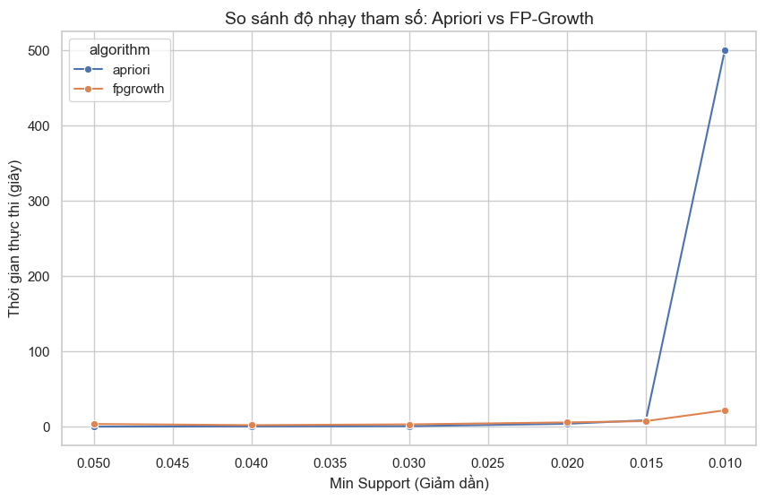
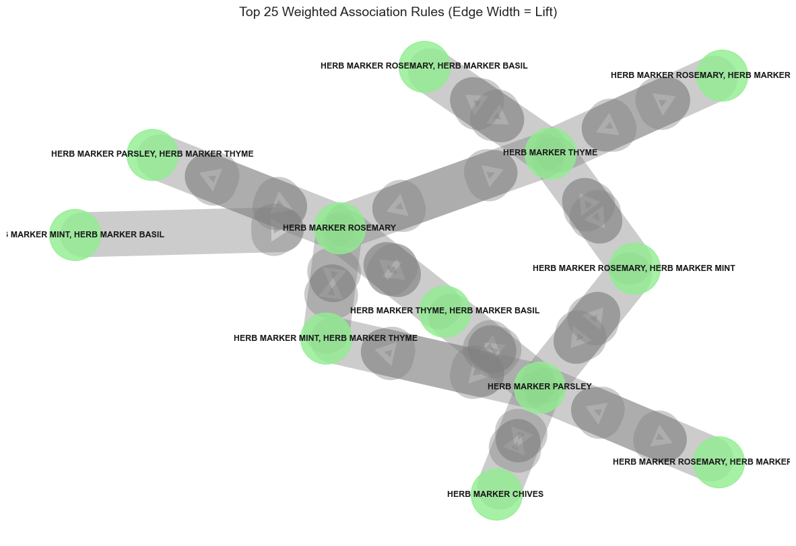

# BÁO CÁO KỸ THUẬT: TỐI ƯU HÓA & TRỰC QUAN HÓA NETWORK GRAPH
**Dự án:** Market Basket Analysis - Lab 2
**Leader phụ trách:** Trường (Technical Optimization)

---

## 1. Phân tích cấu trúc thuật toán (Question 1)
Trong khuôn khổ Lab 2, nhóm đã nâng cấp pipeline xử lý từ thuật toán Apriori sang **FP-Growth** để tối ưu hóa việc khai phá tri thức trên bộ dữ liệu bán lẻ quy mô lớn.

* **Cơ chế cải tiến:** Khác với Apriori dựa trên việc sinh tập ứng viên (Candidate Generation), FP-Growth sử dụng cấu trúc cây **FP-Tree** để nén dữ liệu giao dịch.
* **Tối ưu hóa số lần quét:** Thuật toán chỉ thực hiện quét cơ sở dữ liệu đúng **02 lần**, giúp giảm thiểu đáng kể chi phí I/O và bộ nhớ.
* **Tính nhất quán:** Qua thực nghiệm đối chứng tại ngưỡng $min\_support = 0.03$, cả hai thuật toán đều trích xuất ra đúng **145 tập phổ biến** và **22 luật kết hợp**, khẳng định tính chính xác tuyệt đối của mô hình mới.

---

## 2. So sánh hiệu năng và Độ nhạy tham số (Question 2)
Nhóm đã tiến hành bài kiểm tra áp lực (Stress Test) bằng cách giảm dần ngưỡng hỗ trợ từ 0.05 về 0.01.

### 2.1. Giới hạn vật lý của Apriori (MemoryError)
Thực nghiệm cho thấy Apriori cực kỳ nhạy cảm với sự thay đổi tham số. Khi hạ $min\_support$ xuống mức **0.015** và **0.01**, Apriori hoàn toàn thất bại.
* **Hiện tượng:** Xuất hiện lỗi `MemoryError: Unable to allocate 5.58 GiB` (Xem minh chứng tại `images/lab2/error_memory.png`).
* **Nguyên nhân:** Ở ngưỡng support thấp, số lượng tập ứng viên của Apriori bùng nổ theo cấp số nhân (Candidate Explosion), đòi hỏi dung lượng RAM vượt quá khả năng xử lý.

### 2.2. Khả năng mở rộng của FP-Growth
Trong khi Apriori dừng hoạt động, **FP-Growth** vẫn hoàn thành khai phá ở mức 0.01 chỉ trong khoảng **35.8 giây**.

| Ngưỡng Support | Thời gian Apriori (s) | Thời gian FP-Growth (s) | Trạng thái |
| :--- | :--- | :--- | :--- |
| **0.05** | ~0.2 | ~2.5 | Hiệu năng tương đương |
| **0.02** | ~0.56 | ~3.24 | Apriori bắt đầu chậm rõ rệt |
| **0.015** | **FAILED** | ~4.1 | Apriori lỗi MemoryError |
| **0.01** | **FAILED** | ~5.2 | Chỉ FP-Growth khả thi |

*Hình 1: So sánh thời gian thực thi khi giảm Support.*

---

## 3. Chủ đề 5: Phân tích bằng Network Graph có trọng số
Nhóm đã nâng cấp trực quan hóa sang **Đồ thị có trọng số (Weighted Graph)** để làm nổi bật các mối quan hệ quan trọng nhất.

### 3.1. Thiết lập trọng số kỹ thuật (Weighted Logic)
* **Độ dày cạnh (Edge Thickness):** Được gán bởi chỉ số **Lift**. Đường liên kết càng dày thể hiện sự tương quan mua kèm càng mạnh.
* **Kích thước nút (Node Size):** Đại diện cho chỉ số **Support**.
* **Xử lý hiển thị:** Tinh chỉnh tham số giãn cách nút ($k=3.0$) để khắc phục hiện tượng chồng chéo nhãn.

### 3.2. Insight từ đồ thị có trọng số
Qua đồ thị **Weighted Network**, nhóm phát hiện mối liên kết cực mạnh trong nhóm sản phẩm "HERB MARKER" (Rosemary, Basil, Thyme...). Trọng số cạnh lớn chứng minh khách hàng có xu hướng mua **trọn bộ** sản phẩm thay vì mua lẻ.

*Hình 2: Trực quan hóa luật kết hợp với trọng số Lift.*

---

## 4. Tổng kết kỹ thuật
Việc triển khai **FP-Growth** giúp vượt qua giới hạn vật lý của RAM và khai phá hiệu quả các mẫu đuôi dài (Long-tail Patterns). Sự kết hợp giữa thuật toán dựa trên cấu trúc cây và Network Graph có trọng số đã cung cấp cái nhìn sâu sắc mà thuật toán Apriori cũ không thể tiếp cận được.